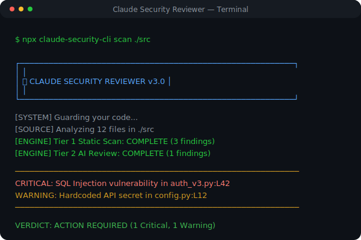

# 🛡️ CLAUDE SECURITY REVIEWER v2.1.0
> **Enterprise-Grade AI-Powered Security Guard**

A lightweight and powerful **Hybrid Security Analysis System** that extends **Claude Code** for professional-grade repository protection. Audit your code for vulnerabilities with the speed of static analysis and the depth of an agentic AI expert.



> [!IMPORTANT]  
> **CRITICAL SECURITY UPGRADE (v2.1.0)**  
> This version includes major security fixes preventing SSRF, Path Traversal, and unauthorized access.  
> **Immediate upgrade is required for all users.**  
> See [UPGRADE_SUMMARY.md](UPGRADE_SUMMARY.md) for details.

---

## 🚀 Quick Start

### Option 1: Docker (Recommended)
The most secure way to run the reviewer.

```bash
# 1. Pull the repository
git pull origin main

# 2. Build the secure image
docker build -t claude-security:2.1.0 .

# 3. Generate a secure token
# Linux/Mac:
export API_TOKEN=$(openssl rand -hex 32)
# Windows PowerShell:
$env:API_TOKEN = -join ((65..90) + (97..122) + (48..57) | Get-Random -Count 32 | % {[char]$_})

# 4. Run the container
docker run -d -p 8089:8089 \
  -e HOST=0.0.0.0 \
  -e API_TOKEN=$API_TOKEN \
  -e ANTHROPIC_API_KEY=sk-... \
  claude-security:2.1.0
```

> **Note:** The server now runs on port **8089** by default inside the container.

### Option 2: Local Python
For development or environments without Docker.

```bash
# 1. Install dependencies (Virtual Environment Recommended)
python -m venv venv
source venv/bin/activate  # or venv\Scripts\activate
pip install -r requirements.txt

# 2. Set Configuration
export API_TOKEN="your-secret-token"  # Required for auth
export ANTHROPIC_API_KEY="sk-..."

# 3. Run Server
python server.py
```

### Option 3: NPX (Quick Test)
```bash
npx github:zakky8/claude-security-reviewer-v2
```

## 🗑️ Uninstalling

If you installed locally or want to clean up:

```bash
# Windows
.\uninstall.bat

# Mac/Linux
./uninstall.sh
```

---

## 🛠️ Usage

### Authentication
**New in v2.1.0:** All API requests must include the `API_TOKEN` as a Bearer token.

```bash
curl -X POST http://localhost:8089/api/scan \
  -H "Authorization: Bearer <YOUR_API_TOKEN>" \
  -F "code_content=print('hello')" \
  -F "api_key=sk-..."
```

### Web Interface
Visit `http://localhost:8089` in your browser.
*   **Token**: You will need to provide your `API_TOKEN` to authenticate.

---

## 🔥 Features

*   **Hybrid Intelligence**: Combining fixed security rules with LLM reasoning (Claude 3.5 Sonnet).
*   **Multi-Source Feed**: Scan snippet, folders, or GitHub URLs (Validated & Sandboxed).
*   **Security Hardening**:
    *   **SSRF Protection**: Strict validation of GitHub URLs.
    *   **Path Traversal**: Sanitized filenames and isolated execution.
    *   **Least Privilege**: Runs as non-root user in Docker.
*   **GitHub Action**: Audit every Pull Request automatically.

---

## 📚 Documentation

Detailed documentation is available in the repository:

*   [**INDEX.md**](INDEX.md) - Navigation guide for all documentation.
*   [**UPGRADE_SUMMARY.md**](UPGRADE_SUMMARY.md) - Overview of v2.1.0 changes.
*   [**SECURITY_HARDENING.md**](SECURITY_HARDENING.md) - Production security guide.
*   [**DEPLOYMENT.md**](DEPLOYMENT.md) - Deployment instructions.
*   [**AUDIT_REPORT.md**](AUDIT_REPORT.md) - Technical security audit results.

---

## 🛡️ Security & Privacy

*   **Isolated Processing**: Files are processed in temporary folders and wiped.
*   **No Data Retention**: Your code is never stored or used for training.
*   **Zero-Knowledge**: API keys are passed per-request and never saved to disk.

---

## 👥 Community
Join the conversation and get support:
- **[Claude Developers Discord](https://anthropic.com/discord)**

---
**Build cool things. Stay secure.** 🚀
